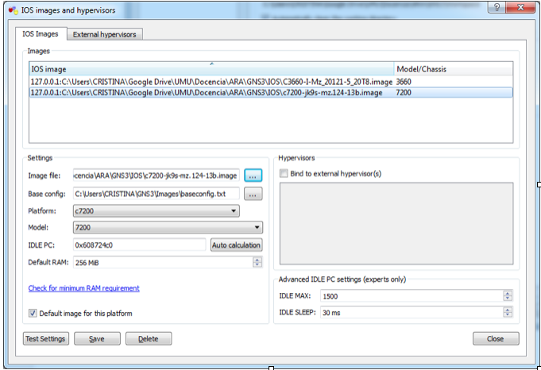
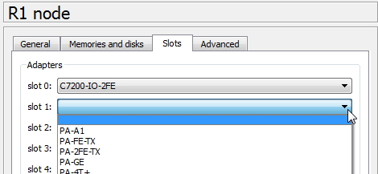
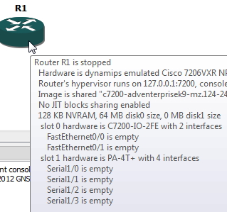
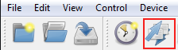
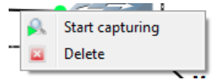
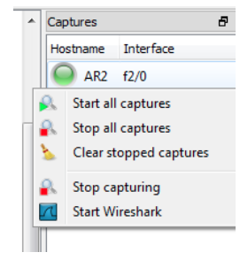

indicar el inet6 auto


Menu:

Accesorios -> VirtualBox
Educación -> GNS3


recordar iniciar sesión en el laboratorio para Internet

mininet configurar las redes y etc network interfaces
tecla - es / en inglés


si no 2 terminales usar screen (pero no viene instalado)


# Práctica 1: GNS3

## Entorno de trabajo

En los laboratorios de prácticas se utilizará GNS3 0.8.X (accesible desde el menú de _Educación -> GNS3_). Para las máquinas virtuales de la topología, usaremos Debian, y vienen dos máquinas, CN y MN instaladas en los laboratorios que se pueden descargar desde Recursos también para trabajar en casa con la topología.

#### Añadir la imagen Cisco c7200

En _Edit -> IOS images and hypervisors_ seleccionamos el fichero c7200.bin en _Image file_, aceptamos cuando pregunta descomprimir la imagen y ya podemos utilizar los routers c7200 para la topología.

>**IMPORTANTE**
>
No viene instalado en los ordenadores de los laboratorios por defecto. Hay que descargar el fichero c7200.bin del Aula Virtual e importarlo **ANTES** de abrir la topología.
>
En casa sólo hace falta hacerlo una vez.




#### Crear o abrir una topología existente

**Después** de añadir la imagen de c7200, podemos comenzar a añadir elementos al panel central de GNS3 y guardar una nueva topología, o abrir una existente a través de _File -> Open project (Ctrl+O)_. Clicar dos veces sobre el fichero _topology.net_ no suele funcionar.

#### Interfaces de red de los routers

En la configuración de cada router, en la pestaña _Slots_ se pueden añadir más tarjetas de red. Recomendamos usar Fast Ethernet y tener en cuenta la nomenclatura de las interfaces de Cisco, donde, por ejemplo, al primer puerto del tercer slot (slot2) con una tarjeta FE lo llamará _FastEthernet2/0_

Slots del router:



Nombre aplicado a las interfaces:




#### Exportar/importar ficheros de configuración de los routers

Cuando terminamos de editar los routers por su terminal y hemos hecho el correspondiente comando ```write``` de Cisco, debemos **guardar** las configuraciones exportando la configuración o guardando la topología, que automáticamente exportará los ficheros. Podemos usar el menú o los accesos directos de la barra superior:

 

Para **importar** las configuraciones previas, una vez cargada la topología, pulsamos el botón marcado en rojo de arriba, **elegimos** importar (por defecto elegirá exportar) e indicamos el directorio _config/_ donde están los ficheros de configuración de cada router.


#### Añadir máquinas virtuales de VirtualBox

En _Edit -> Preferences -> VirtualBox_ primero actualizamos la lista de máquinas virtuales instaladas, y entonces podemos ir añadiendo máquinas virtuales a GNS3 dándoles un nombre, un número de interfaces (NIC) y una máquina virtual existente de la lista.

Cerramos la ventana y al añadir un nuevo elemento de tipo _VirtualBox guest_ al panel central de GNS3 nos pedirá elegir de entre las máquinas añadidas antes.

> Hay que tener en cuenta al elegir los NIC de cada máquina que el primero (eth0) nos servirá para tener conexión a Internet a través de NAT, y el segundo (eth1) y sucesivos para conectarse a los switches de la topología. Una de las máquinas de la práctica necesitará conectarse a más de un switch a la vez.


Las máquinas virtuales proporcionadas incluyen Debian, que tiene la particularidad de necesitar permisos de administrador para ejecutar incluso ```ifconfig```. Sin que sirva de precedente en vuestra carrera profesional, trabajaremos con root en todo momento utilizando ```su```.


En caso de no utilizar las máquinas virtuales del laboratorio, hay que modificar el fichero _/etc/network/interfaces_ y añadir las interfaces de red para GNS3 con IPv6 automático:
```bash
iface eth1 inet6 auto
```


#### Capturar tráfico con Wireshark

Una vez está la topología arrancada, con el botón derecho del ratón sobre un enlace de red podemos elegir _Start capturing_ (tened en cuenta que no se vaya a cortar el enlace a mitad de captura).



En el panel de la derecha nos aparecerá la interfaz de captura, y con clic derecho podemos elegir _Start Wireshark_ para ver en directo la captura de tráfico y **exportarla** en el directorio que queramos.




#### Comandos Cisco de utilidad

Enrutamiento IPv6
```
ipv6 unicast-routing
```

Soporte en interfaz
```
interface <type> <slot>/<port>
    ipv6 enable
```

Asignar dirección IPv6
```
interface <type> <slot>/<slot>
    Manual: ipv6 address <address>/<prefixlen>
    Autoconf: ipv6 address <prefix>/<prefixlen> eui-64
```

Mostrar interfaces IPv6
```
show ipv6 interface
```

Mostra la ayuda
```
<comando> ?
```

Ruta estática
```
ipv6 route <prefix>/<prefixlen> <interface>

Ej: ipv6 route 2cae::/42 Serial 1/1
```

Mostrar tabla de rutas IPv6
```
show ipv6 route
```

Activar información de debug
```
debug ipv6 routing
```

Crear instancia OSPF
```
ipv6 router ospf <process-id>       ! puede ser cualquier valor, por ejemplo 100
    router-id <32bits-id>           ! identificará el router en un formato como IPv4, pero no será su dirección. Por ej. 1.1.1.1
    ! Podemos declarar áreas stub, interfaces pasivas, redistribución y en general todo lo estudiado en Arquitectura de Redes
```

Anuncio de subred por una interfaz con OSPF
```
interface <type> <slot>/<port>
    ipv6 ospf <process-id> area <area-id>   ! el process-id debe ser el mismo que al activar OSPF
```

Mostrar información de OSPF
```
show ipv6 ospf <process-id>
show ipv6 ospf <process-id> [<area-id] database
show ipv6 ospf <process-id> [<area-id] neighbor
show ipv6 ospf <process-id> [<area-id] interface
```


Habilitar HA en una subred
```
interface <type> <slot>/<port>  ! seleccionar interfaz de la subred
    ipv6 mobile home-agent      ! habilitar modo HA
```

Configuración de la interfaz MIPv6
```
interface <type> <slot>/<port>
    ipv6 nd prefix <prefix>/<prefixlen>
    ipv6 nd ra interval <msec>
```

Obtener información MIPv6
```
show ipv6 mobile globals
show ipv6 mobile home-agents
show ipv6 mobile binding
show ipv6 mobile traffic
```

Activar información de _debug_
```
debug ipv6 mobile forwarding
debug ipv6 mobile registrations
debug ipv6 mobile binging-cache
debug ipv6 mobile home-agent
```


## Movilidad

Explicar demonio mip6d

## Utilidades


Si GNS3 es muy inestable, se puede configurar un router por terminal, exportar su configuración y programar el resto usando la el fichero exportado como _plantilla_ de la sintaxis de Cisco.

Si no se quiere utilizar la terminal xterm que usan los routers de GNS3 por defecto, en la configuración se puede sustituir por esta línea que lanzará la terminal de gnome, la que utiliza Ubuntu por defecto.
```
gnome-terminal --command='telnet %h %p' >/dev/null 2>&1 &
```


Durante la ejecución de un ping o traceroute en una máquina virtual, como no hay opción de copiar y pegar la salida de la terminal, hay que enviar la salida a un fichero que luego copiaremos (por scp por ejemplo) al _host_. El problema es que si guardamos la salida a fichero del ping, no podremos ver cuándo hace el salto el MN. Con los comandos _tee_ y less se puede guardar a fichero y ver en la terminal a la vez la ejecución de un comando:

```bash
ping -I eth1 8.8.8.8 | tee out.txt | less
! la opción -I eth1 obliga a enviar los paquetes por dicha interfaz
```


Para acelerar las pruebas de ping y traceroute donde hay que escribir la dirección IPv6 de los hosts, y no es cómodo estar buscando en el historial de comandos cada vez, es mejor escribirse un script para cada uno que se guardará entre ejecuciones en la máquina virtual:


```
#!/bin/bash
ping 8.8.8.8 | tee out.txt | less
```

```
#!/bin/bash
mip6d -c /usr/local/etc/mip6d.conf
```

No os olvidéis del ```chmod +x ```.


Para comandos largos que no caben en la pantalla de VirtualBox, como ```ifconfig```, podéis usar el comando ```less``` para leer cómodamente el texto.
```bash
ifconfig | less
```


# Trabajar con mininet

## Nomenclatura

Cuando [descargas mininet](http://mininet.org/download/) te indica que uses preferiblemente la versión de máquina virtual. Además en los laboratorios de prácticas se suele utilizar la MV para asegurarse que las instalaciones son correctas.

El problema surge de que mininet no llama diferente al programa, directorios y máquinas virtuales, y cuando empiezas con un tutorial suele llevar a confusiones.

Por ello nuestra **nomenclatura** será: *mininet_vm* para la máquina virtual, _mininet_ para el programa, y _mininet/_ para los directorios.

## ¿Cómo trabajar con mininet_vm?

### Conexiones

Las máquinas virtuales de VirtualBox suelen dar facilidades en entornos gráficos para el portapapeles y paso de ficheros. La MV de mininet_vm no trae entorno gráfico.

Para trabajar con mininet_vm lo mejor es configurar en VirtualBox una interfaz de red solo-anfitrión _vboxnet0_, además del adaptador puente, NAT, etc. que nos sirve para acceder a Internet.

Normalmente nos conectaremos por la red de _vboxnet0_ en dos sesiones SSH, una para controlar **mininet** (al menos esta con X11forwarding) y otra para **POX**. Para pasar **ficheros** podemos usar scp, sftp, sshfs, etc.
Se puede utilizar sshfs para montar un directorio remoto en un directorio local y poder usar así editores de texto gráficos del sistema host.
Para usuarios de Windows, recomiendo [MobaXterm](http://mobaxterm.mobatek.net/) Home Edition para las conexiones SSH -X.

TODO: poner comandos para conectar en remoto con ssh -X, sshfs y fotos de Vbox con las interfaces

## Organización de directorios de mininet_vm

En codigo poner un tree de los directorios importantes

## Ejecutar mininet

Ejemplo de mininet + script bash

### Crear una topología mininet


#### Trabajar con hosts de mininet


## Ejecutar POX

Indicar dónde se encuentra el ejecutable, los ficheros de los controladores y que no pongan .py

### Programar un controlador POX

Indicar bibliografía y codigo de pox para referencia.


```
$ ssh mininet@192.168.56.101 -X
```
